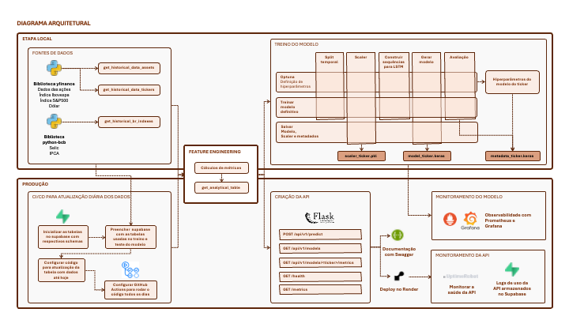

# Modelo LSTM | Predição de valor de fechamento na bolsa de valores

*Tech Challenge da Fase 4 da [pós-graduação em Engenharia de Machine Learning FIAP](https://postech.fiap.com.br/curso/machine-learning-engineering/)*

> 📈 Link para a API: https://lstm-stock-predictor-api.onrender.com/

> 🎥 Vídeo com demonstração técnica do projeto (em breve)

## 🎯 Sobre o projeto
O projeto tem como objetivo a construção e deploy de um modelo de redes neurais Long-Short Term Memory (LSTM) para prever valor de fechamento das ações de uma empresa da bolsa.

Para saber mais sobre o modelo LSTM:

- [Visão geral sobre LSTM](docs/about_lstm.md)
- [Variáveis usadas no modelo](docs/about_stock_predicting_variables.md)
- [Arquitetura da LSTM usada no projeto](docs/about_lstm_architecture.md)
- [Métricas de avaliação do modelo](docs/about_lstm_evaluation_metrics.md)

## ⚙️ Funcionalidades
1. **Pré-processamento dos dados**
    - Coleta dos dados com as bibliotecas `yfinance` e `bcb`
    - Feature engineering
2. **Desenvolvimento do modelo LSTM**
    - Definição da arquitetura LSTM
    - Definição de hiperparâmetros com Optuna
    - Treinamento e refino dos modelos definitivos
    - Avaliação das métricas dos modelos
    - Exportação dos artefatos - model.keras, scaler e metadata
    - Monitoramento do modelo
3. **Armazenamento dos dados no Supabase**
    - Criação do projeto no Supabase
    - Criar tabelas para receber os dados no SQL Editor (código disponivel em [create_tables_sql_editor.txt](src/create_tables_sql_editor.txt))
    - Conexão com o banco (credenciais em .env)
    - Função para popular as tabelas e atualizar em [sync.py](sync.py)
4. **CI/CD para atualização diária dos dados**
    - Rotina no GitHub Actions para executar o [sync.py](sync.py) diariamente às 20h
5. **Construção da API**
    - Definição dos endpoints
    - Obtenção dos dados a serem servidos nos endpoints a partir da conexão com o banco
    - Documentação obtida automaticamente com Swagger
6. **Monitoramento com Prometheus e Grafana**
    - Acompanhar os acertos do modelo
    - Ver se está havendo data drift dos modelos treinados
7. **Criação da interface do app**
    - Gráficos e big numbers com Python
    - Estrutura das páginas com HTML
    - Estilos com CSS
    - Estrutura dinãmica com javascript
8. **Deploy**
    - Docker
    - Render
    - Monitoramento do endpoint `/health` no UptimeRobot para evitar coldstart da aplicação

## 📐 Arquitetura


## 📂 Estrutura do projeto
```
├── .github/
│   └── workflows/
│       └── sync.yml
├── docker/
│   └── comandos_terminal.txt
├── docs/
│   ├── about_lstm.md
│   ├── about_lstm_architecture.md
│   ├── about_lstm_evaluation_metrics.md
│   ├── about_stock_predicting_variables.md
│   └── diagrama_arquitetural.png
├── grafana/
├── prometheus/
│   └── prometheus.yml
├── src/
│   ├── api/
│   │   ├── api_endpoints.py
│   │   └── home_numbers_and_plots.py
│   ├── static/
│   │   ├── favicon.svg
│   │   ├── github.svg
│   │   └── swagger.svg
│   ├── templates/
│   │   └── home.html
│   ├── __init__.py
│   ├── build_dashboard_cache.py
│   ├── create_tables_sql_editor.txt
│   ├── generate_predict.py
│   ├── get_tables.py
│   ├── instances.py
│   ├── monitoring.py
│   ├── monitoring_middleware.py
│   ├── setup_logging.py
│   ├── sync_database.py
│   └── utils.py
├── tests/
│   ├── api_tests.ipynb
│   └── get_folder_tree.ipynb
├── train_model/
│   ├── dados/
│   ├── models/
│   │   ├── lstm_ABEV3.keras
│   │   ├── lstm_LREN3.keras
│   │   ├── lstm_RENT3.keras
│   │   ├── lstm_SMFT3.keras
│   │   ├── metadata_ABEV3.pkl
│   │   ├── metadata_LREN3.pkl
│   │   ├── metadata_RENT3.pkl
│   │   ├── metadata_SMFT3.pkl
│   │   ├── scaler_ABEV3.pkl
│   │   ├── scaler_LREN3.pkl
│   │   ├── scaler_RENT3.pkl
│   │   └── scaler_SMFT3.pkl
│   ├── src
│   │   ├── generate_predict.py
│   │   ├── get_tables.py
│   │   └── model_functions.py
│   ├── 1_get_analytical_table_train_model.ipynb
│   ├── 2_eda.ipynb
│   ├── 3_testes_optuna.ipynb
│   ├── 4_get_best_params_tickers.ipynb
│   ├── 5_testes_modelo.ipynb
│   ├── 6_refino_modelos.ipynb
│   └── 7_salvar_pickle_metadata.ipynb
├── .env
├── .gitignore
├── .python-version
├── config.py
├── docker-compose.yml
├── main.py
├── README.md
├── requirements.txt
└── sync.py
```

## 🧭 Rotas da API (Endpoints)

A documentação é obtida automaticamente com Swagger e pode ser acessada em: https://lstm-stock-predictor-api.onrender.com/apidocs/

Método | Endpoint | Descrição
--- | --- | ---
POST | `/api/v1/predict/<ticker>` | Retorna a previsão do preço de fechamento para D+1.
GET | `/api/v1/models` | 	Lista os modelos e tickers suportados.
GET | `/api/v1/models/<ticker>/metrics` | Retorna as métricas do modelo treinado.
GET | `/health` | Endpoint para health check do serviço.
GET | `/metrics` | Métricas Prometheus para monitoramento.

## 🛠️ Exemplos de chamadas com requests/responses com Python
Se não tiver a biblioteca `requests` instalada → executar no terminal `pip install requests`
```
import requests
url = 'https://lstm-stock-predictor-api.onrender.com/'
```

### 1. Obter predict em D+1
```python
ticker = "ABEV3"
endpoint = f"{url}/api/v1/predict/{ticker}"
resp = requests.post(endpoint)
print(resp.status_code)
resp.json()
```

### 2. Verificar modelos disponíveis
```python
endpoint = f"{url}/api/v1/models"
resp = requests.get(endpoint).json()
resp
```

### 3. Métricas dos modelos
```python
ticker = "ABEV3"
endpoint = f"{url}/api/v1/models/{ticker}/metrics"
resp = requests.get(endpoint)
print(resp.status_code)
resp.json()
```

### 4. Verificar status da API
```python
endpoint = f"{url}/health"
resp = requests.get(endpoint)
print(resp.status_code)
resp.json()
```

## 🚀 Evolução do projeto

- Limitações da predição:
  - O mercado é influenciado por eventos externos: taxa de juros, inflação, eleições, guerras, resultados trimestrais, notícias; não há como usar estes dados nas predições
- Melhorar o desempenho do modelo de todos os tickers usados
  - Para os tickers RENT3, LREN3 e SMFT3, os gráficos observados na aplicação mostram que o modelo ficou muito ruim, mas foram mantidos para compor o projeto de engenharia
  - Avaliar as features utilizadas (remover, adicionar outras)
  - Fazer avaliações no Optuna com outras janelas de valores para os hiperparãmetros
- Retreino do modelo (diária ou semanalmente)
  - Monitorar a evolução do desempenho das novas versões
  - Comparar o valor predito com o valor observado
- Armazenar os artefatos do modelo no bucket do Supabase para puxar de lá e não do repositório
- Evitar fazer previsões para o final de semana e feriados
- Adicionar um check no GitHub Actions para verificar se a lib yfinance já foi atualizada, se não tiver sido, tentar novamente em 30 minutos
- Refinar o dash de monitoramento do Grafana
- Atualmente, o Prometheus e o Grafana só rodam de forma local, com o docker aberto. Futuramente, pode ser interessante hospedá-los em um servidor como Kubernetes e apontar o Prometheus para o endpoint `/metrics` da API em produção

